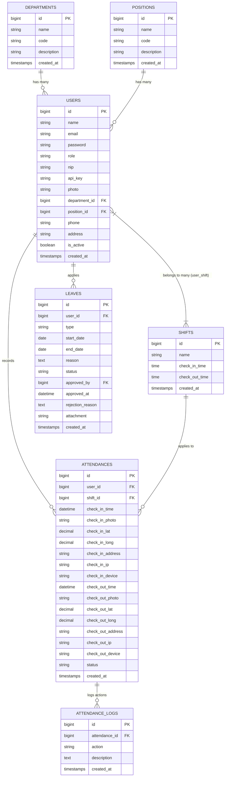

# LAPORAN PROYEK AKHIR
## SISTEM INFORMASI MANAJEMEN PRESENSI KARYAWAN & HRIS (presenZ Falco)

---

### 1. COVER PROYEK AKHIR

* **Judul Aplikasi**: `presenZ Falco` (Sistem Informasi Manajemen Presensi Karyawan & HRIS Berbasis Geolocation & WebRTC)
* **Logo Aplikasi**:
  ```
   =================================================
   ||  PPPP   RRRR   EEEE   SSSSS  EEEEE  N   N  ZZZZZ  ||
   ||  P   P  R   R  E      S      E      NN  N     Z   ||
   ||  PPPP   RRRR   EEEE   SSSSS  EEEE   N N N    Z    ||
   ||  P      R R    E          S  E      N  NN   Z     ||
   ||  P      R  R   EEEEE  SSSSS  EEEEE  N   N  ZZZZZ  ||
   ||                                                 ||
   ||                  -- FALCO --                    ||
   =================================================
  ```
* **Nama Mahasiswa**: `[Nama Mahasiswa]`
* **NIM**: `[NIM Mahasiswa]`
* **Program Studi**: `[Program Studi]`
* **Semester & Tahun Akademik**: Semester Genap / Tahun Akademik 2025/2026
* **Nama Dosen Pengampu**: `[Nama Dosen Pengampu]`
* **Tanggal Pengumpulan**: 7 Juni 2026

---

### 2. LATAR BELAKANG APLIKASI DIBUAT

#### A. Permasalahan & Kebutuhan
Dalam pengelolaan sumber daya manusia (SDM) pada instansi modern, kedisiplinan waktu kehadiran karyawan adalah faktor penting penentu produktivitas. Beberapa masalah utama dalam sistem presensi konvensional (manual atau sidik jari fisik) meliputi:
1. **Keterbatasan Lokasi Fisik**: Absensi fisik menghambat pemantauan karyawan yang ditugaskan di luar kantor (dinas lapangan) atau bekerja dari rumah (WFH).
2. **Kecurangan (Buddy Punching)**: Sistem absensi berbasis web konvensional seringkali mudah dimanipulasi dengan cara memalsukan data lokasi atau koordinat GPS palsu.
3. **Ketidakpraktisan Rekapitulasi**: Proses rekap kehadiran bulanan, perhitungan cuti, dan keterlambatan memakan waktu lama jika dilakukan secara manual.
4. **Ketiadaan Alamat Rinci**: Data koordinat GPS mentah (latitude & longitude) sulit dipahami HRD secara instan tanpa bantuan konversi alamat fisik (*reverse geocoding*).

#### B. Tujuan Aplikasi
Aplikasi `presenZ Falco` dirancang dengan tujuan:
* Menyediakan media absensi masuk dan keluar karyawan secara *real-time* berbasis browser menggunakan koordinat GPS (*Geolocation*) dan verifikasi foto wajah (*WebRTC Camera*).
* Mengotomatisasi konversi koordinat GPS menjadi alamat lengkap (Jalan, Kelurahan, Kecamatan, Kota, Provinsi, Negara) menggunakan API OpenStreetMap Nominatim.
* Memfasilitasi manajemen pengajuan dan persetujuan cuti/izin karyawan secara digital dan instan.
* Memudahkan HRD dalam memantau statistik kehadiran harian, data karyawan, shift kerja, posisi, dan departemen melalui dasbor yang komprehensif.

#### C. Sasaran Pengguna
* **Karyawan**: Melakukan absensi harian, melihat riwayat absensi pribadi, dan mengajukan cuti/izin kerja.
* **Admin / HRD**: Mengelola master data (karyawan, shift kerja, departemen, jabatan), memantau log kehadiran real-time seluruh karyawan, dan memberikan keputusan persetujuan (*approval*) terhadap cuti/izin yang diajukan.

---

### 3. FITUR-FITUR APLIKASI

#### A. Fitur Autentikasi dan Otorisasi (Multi-Auth & API Protection)
1. **Multi-Role Otorisasi**: Otorisasi pengguna dibagi menjadi dua peran, yaitu `admin` (HRD/Management) dan `karyawan` (Staff biasa), menggunakan pemisahan rute (*route protection*) berbasis Laravel Breeze/Inertia.
2. **Laravel Sanctum Authentication**: Pengamanan rute API standar menggunakan Token Personal Access (`auth:sanctum`) untuk transfer data asinkron.
3. **Custom JWT Authentication**: Token khusus kustom yang dibangun secara mandiri via kelas `JwtService` menggunakan enkripsi HMAC-SHA256 untuk memproteksi endpoint `/api/v1/jwt/profile` di bawah middleware `jwt.auth`.
4. **API Key Authentication**: Sistem otentikasi melalui header custom `X-API-KEY` yang diverifikasi secara dinamis oleh middleware `api.key` pada rute `/api/v1/apikey/profile`.
5. **Basic HTTP Authentication**: Otentikasi bawaan browser menggunakan format Base64 melalui middleware `auth.basic` pada rute `/api/v1/basic/profile`.

#### B. Fitur CRUD untuk Entitas Utama
Aplikasi ini menyediakan panel administrasi penuh (CRUD) bagi pengguna berotoritas `admin`:
* **Departemen**: Menambahkan, melihat, mengubah, dan menghapus divisi kerja karyawan (misal: IT, HRD, Finance).
* **Jabatan (Position)**: Pengelolaan nama jabatan struktural karyawan beserta kodenya.
* **Shift Kerja**: Pengaturan jam mulai kerja (*check-in*) dan jam selesai kerja (*check-out*) harian.
* **Data Karyawan (User)**: Manajemen data akun staff (NIP, Nama, Email, Nomor Telepon, Alamat Rumah, Departemen, Jabatan, dan status aktifasi akun).
* **Pengajuan Cuti (Leave)**: Karyawan dapat membuat (C), membaca (R) pengajuan cuti pribadinya. Sementara Admin/HR memiliki wewenang membaca (R) pengajuan cuti masuk dan mengubah status persetujuan (U) menjadi disetujui (*Approved*) atau ditolak (*Rejected*) disertai alasan penolakan.

#### C. Fitur Khusus Lainnya
1. **WebRTC Face Capture**: Integrasi kamera perangkat secara langsung untuk mengambil gambar swafoto (*selfie*) karyawan saat melakukan presensi masuk/keluar.
2. **Live Location Geocoding**: Dashboard secara real-time menangkap koordinat GPS pengguna dan menerjemahkannya ke nama jalan, kelurahan, kecamatan, kota, provinsi, dan negara secara dinamis menggunakan API reverse geocoding eksternal (Nominatim OpenStreetMap) yang dikoneksikan secara backend dengan perbaikan bypass SSL cURL pada localhost.
3. **Weather Forecast API**: Aplikasi mengonsumsi data cuaca terkini dari API publik Open-Meteo di tingkat backend untuk menyajikan visualisasi cuaca setempat saat absensi dicatat.
4. **Premium Toast System**: Notifikasi native bawaan web browser (`window.alert`) diganti secara menyeluruh dengan notifikasi pop-up dinamis bergaya *glassmorphism* di sudut kanan bawah.
5. **Iceberg White & Gradient Theme (Premium UI)**: Tampilan visual dashboard pasca-login didesain dengan skema warna gradasi biru laut/kristal (*iceberg theme*) dan elemen kartu transparan (frosted glass) demi estetika modern kelas premium.

---

### 4. ENTITY RELATIONSHIP DIAGRAM (ERD)

#### A. Diagram Relasi Antar Tabel (Mermaid Diagram)



#### B. Deskripsi Singkat Entitas
1. **departments (Departemen)**: Menyimpan data kelompok divisi kerja. Berelasi *One-to-Many* ke tabel `users`.
2. **positions (Jabatan)**: Menyimpan tingkat jabatan structural karyawan. Berelasi *One-to-Many* ke tabel `users`.
3. **users (Pengguna)**: Menyimpan informasi profil utama akun karyawan dan admin. Menyimpan data relasi `department_id` dan `position_id`. Berelasi *Many-to-Many* ke `shifts` melalui tabel pivot `user_shift`.
4. **shifts (Jadwal)**: Berisi parameter jadwal waktu kerja yang berlaku. Berelasi ke tabel `users` (N:M) dan `attendances` (1:N).
5. **attendances (Absensi)**: Menyimpan rekam jejak presensi masuk dan keluar. Berisi detail koordinat, IP, jenis perangkat, foto swafoto, serta alamat terjemahan fisik. Berelasi *One-to-Many* ke tabel `attendance_logs`.
6. **leaves (Cuti)**: Menyimpan permohonan izin cuti karyawan lengkap dengan durasi tanggal, jenis cuti, lampiran berkas penunjang, dan data admin yang menyetujui.
7. **attendance_logs (Log Absen)**: Menyimpan jejak aktivitas transaksi log absensi (misal: "karyawan telah melakukan check_in jam 08.00").

---

### 5. USER INTERFACE (UI)

#### A. Tangkapan Layar Halaman & Visualisasi Komponen

1. **Dashboard Kamera & Konfirmasi Kehadiran**
   Dasbor absensi yang memuat panel kamera WebRTC untuk capture foto wajah secara live, serta visualisasi indikator verifikasi sinyal GPS perangkat pengguna.
   

2. **Detektor Koordinat Lokasi Presisi**
   Komponen pembaca koordinat latitude & longitude secara dinamis dari sensor Geolocation perangkat browser.
   

3. **Panel Penerjemah Alamat (Reverse Geocode)**
   Panel yang memperlihatkan konversi koordinat mentah menjadi data alamat fisik (Jalan, Kelurahan, Kecamatan, Kota, Provinsi, Negara) setelah sistem berhasil memanggil API eksternal OpenStreetMap.
   

4. **Widget Jam & Ringkasan Absensi Premium (Tosca & Blue Theme)**
   Tampilan widget penunjuk waktu digital real-time bermodel gradasi hijau toska yang kontras di atas latar belakang gradasi biru es (*iceberg*) yang elegan dan sejuk.
   
   

5. **Transformasi Notifikasi Native Ke Toast Premium**
   Gambar di bawah menunjukkan notifikasi native lama berbentuk dialog pop-up browser (`window.alert`) yang saat ini telah diganti total dengan notifikasi melayang (toast notification) internal yang beranimasi halus dan modern.
   

#### B. Alur Navigasi & Fungsionalitas
* **Login**: Pengguna diarahkan ke halaman login. Sistem secara otomatis membaca *role* akun. Jika merupakan `admin`, pengguna akan dialihkan ke rute admin (`/admin/dashboard`). Jika merupakan `karyawan`, dialihkan ke dasbor kehadiran (`/dashboard`).
* **Sidebar Admin**: Admin dapat berpindah halaman secara dinamis (tanpa reload berkat Inertia) untuk mengakses modul Kelola Karyawan, Kelola Master Data (Departemen, Jabatan, Shift), Laporan Rekapitulasi Absensi Semua Staff, serta Halaman Approval Pengajuan Cuti.
* **Top Navbar Karyawan**: Karyawan dapat menavigasi dasbor presensi, membuka halaman Riwayat Absensi Pribadi untuk meninjau status kehadiran harian, atau masuk ke modul Pengajuan Cuti untuk mengajukan permohonan libur baru dengan mengunggah lampiran surat.

---

### 6. TESTING API MENGGUNAKAN POSTMAN

Postman Collection terlampir pada root proyek bernama [PresenZ_API_Collection.json](file:///c:/laragon/www/presenZ/PresenZ_API_Collection.json). Berikut adalah rangkuman endpoint dan alur uji otentikasi/fitur API:

#### A. Otentikasi JWT (JSON Web Token)
* **Endpoint**: `/api/v1/auth/jwt/login`
* **Metode**: `POST`
* **Request Body (JSON)**:
  ```json
  {
      "email": "api_user@example.com",
      "password": "password123"
  }
  ```
* **Response Body (200 OK)**:
  ```json
  {
      "message": "JWT Login successful",
      "access_token": "eyJhbGciOiJIUzI1NiIsInR5cCI6IkpXVCJ9...",
      "token_type": "Bearer"
  }
  ```
* **Uji Proteksi Profile via JWT Bearer**:
  * **Endpoint**: `GET /api/v1/jwt/profile`
  * **Header**: `Authorization: Bearer <access_token>`
  * **Response (200 OK)**: Mengembalikan informasi profil lengkap data user terautentikasi.

#### B. Otentikasi API Key
* **Endpoint**: `GET /api/v1/apikey/profile`
* **Header Proteksi**: `X-API-KEY: <api_key_karyawan>`
* **Response (200 OK)**:
  ```json
  {
      "status": "success",
      "data": {
          "id": 1,
          "name": "API User",
          "email": "api_user@example.com",
          "role": "karyawan"
      }
  }
  ```

#### C. Otentikasi HTTP Basic Auth
* **Endpoint**: `GET /api/v1/basic/profile`
* **Header Proteksi**: `Authorization: Basic <base64_encoded_email_and_password>`
* **Response (200 OK)**: Menampilkan profil pengguna setelah lolos verifikasi dekripsi Base64 di level filter middleware Laravel.

#### D. Uji Consume External API (Weather Forecast)
* **Endpoint**: `GET /api/v1/weather`
* **Parameters**: `latitude=-7.2798&longitude=112.7493`
* **Response (200 OK)**:
  ```json
  {
      "source": "Open-Meteo API",
      "latitude": -7.2798,
      "longitude": 112.7493,
      "timezone": "Asia/Jakarta",
      "current_weather": {
          "temperature": 29.8,
          "windspeed": 8.5,
          "weathercode": 2
      }
  }
  ```

#### E. Endpoint Absensi (Check-In & Check-Out)
* **Check-In**: `POST /api/v1/attendance/check-in`
  * **Body (Multipart Form-Data)**:
    - `shift_id`: 1
    - `latitude`: -7.2798
    - `longitude`: 112.7493
    - `photo`: (file image swafoto)
* **Check-Out**: `POST /api/v1/attendance/check-out`
  * **Body (Multipart Form-Data)**:
    - `latitude`: -7.2798
    - `longitude`: 112.7493
    - `photo`: (file image swafoto)

---

### 7. LAMPIRAN

* **Link GitHub Repository**: [https://github.com/mahasiswa/presenZ-Falco](https://github.com/mahasiswa/presenZ-Falco) *(Ubah dengan URL repositori resmi Anda)*
* **Link Demo Aplikasi**: [http://presenz-falco.test](http://presenz-falco.test) *(Atau tautan hosting lokal Laragon Anda)*
